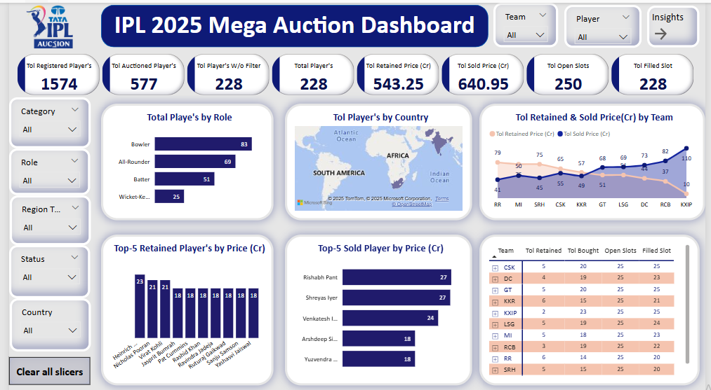

# ipl-2025-auction-dashboard

A Power BI dashboard analyzing data from the IPL 2025 Mega Auction covering 1500+ players.

### 📊 Project Highlights

- Built an interactive Power BI dashboard to explore auction data of over 1500 players.
- Created dynamic slicers and filters for user-driven analysis by **Team**, **Player**, **Role**, **Status**, and **Region**.
- Developed KPIs and custom DAX measures to track:
  - Total spend
  - Player retention value
  - Sold price
  - Slot usage per team
- Identified key trends:
  - Bowlers and All-Rounders were the most in-demand roles.
  - KXIP had the highest overall auction spend.
  - RR led in player retention strategy.
- Used **Top-N charts** to visualize the most expensive buys (sold & retained).
- Tools: Power BI, Power Query, DAX, Data Modeling, Data Visualization

### 🖼️ Dashboard Preview

Here is a screenshot of my Power BI dashboard:

### 📈 Key Insights

- 🏏 **Bowlers and All-Rounders** had the most filled slots.
- 💰 **KXIP** had the highest auction spend.
- 🔁 **RR** retained the highest number of players.
- 📊 Dynamic charts enabled granular filtering and comparison by team and player.

### 🔗 Project Link

https://github.com/jakeer-da/ipl-2025-auction-dashboard.git

### 🙋‍♂️ About Me

**Syed Jakeeer Hussin** 

🎯 **Junior Data Analyst** with hands-on experience in building interactive dashboards, uncovering trends, and delivering data-driven insights.

📊 Skilled in SQL, Power BI Python(Basics), and Excel for end-to-end analytics solutions.

#### 💼 Core Competencies

| Skill Area             | Tools & Technologies                                       |
|------------------------|------------------------------------------------------------|
| **Data Visualization** | Power BI, Excel Charts & Graphs                   |
| **Data Analytics**     | SQL, Excel (Pivot Tables, VLOOKUP, Data Cleaning)          |
| **Programming**        | Python (Pandas, Matplotlib, Seaborn)                |
| **Database**           | MySQL                                       |
| **DAX & Measures**     | KPIs, Ratios, Time Intelligence, Growth Metrics            |
| **Dashboard Design**   | Interactive layouts, slicers, filters, drill-through views |
| **Tools & Platforms**  | Jupyter Notebook, Google Colab, GitHub, Excel, Power BI Service    

### 👨‍💻 Author
**Syed Jakeeer Hussin** 

### 📎 License

This project is for educational and demonstration purposes only. 

All data used is fictional or anonymized.
